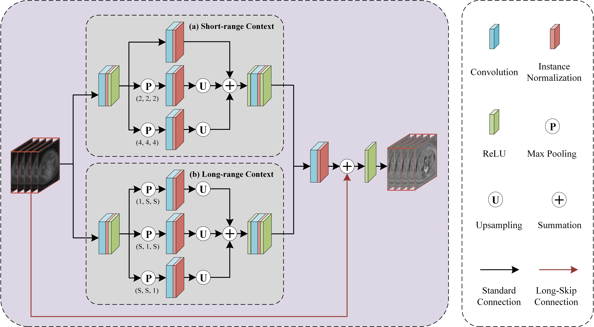
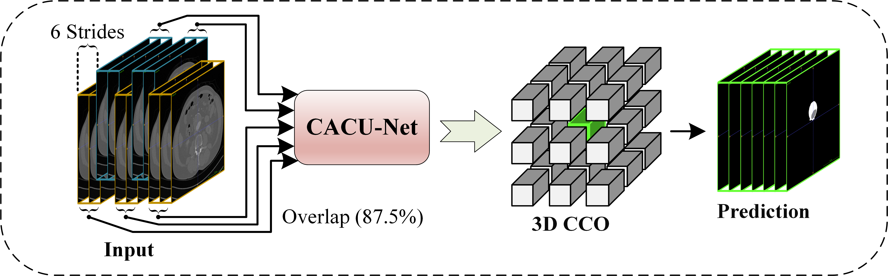

# Automatic segmentation of abdominal aortic aneurysms from CT angiography using a context-aware cascaded U-Net

```
@article{mu2023automatic,
  title={Automatic segmentation of abdominal aortic aneurysms from CT angiography using a context-aware cascaded U-Net},
  author={Mu, Nan and Lyu, Zonghan and Rezaeitaleshmahalleh, Mostafa and Zhang, Xiaoming and Rasmussen, Todd and McBane, Robert and Jiang, Jingfeng},
  journal={Computers in Biology and Medicine},
  volume={158},
  pages={106569},
  year={2023},
  publisher={Elsevier}
}
```


## Usage

### 0. Dependencies
Some core dependencies:

- torch == 1.11.0
- numpy==1.21.2
- SimpleITK==2.1.1.2
- tqdm==4.62.3

### 1. Data Preparation
* Please follow the instructions for placing the data in `dataset/`, which should be structured as follows:

```
AAATData
├── train
|   ├── ct
|   |	├── volume-0.nii.gz
|   |   └── volume-1.nii.gz
|   |   ...
|   |   └── volume-39.nii.gz
|   └── label
|    	├── segmentation-0.nii.gz
|       └── segmentation-1.nii.gz
|       ...
|       └── segmentation-39.nii.gz
└── test
    ├── ct
    |	├── volume-0.nii.gz
    |   └── volume-1.nii.gz
    |   ...
    |   └── volume-9.nii.gz
    └── label
     	├── segmentation-0.nii.gz
        └── segmentation-1.nii.gz
        ...
        └── segmentation-9.nii.gz
```


* Test the validity of maximum and minimum thresholds for training data using `data_prepare/get_threshold.py` 

```
python data_prepare/get_threshold.py
```

* Crop the 3D data for the training sets using `data_prepare/get_data.py`

```
python data_prepare/get_data.py
```

### 2. Training

* Run `train.py` to start the training

```
python train.py
```

### 3. Testing
* Run `test.py` to start the testing

```
python test.py
```


## Paper Details

### Method Detials






### Comparison


## Cite
If you find our code useful for your research, please cite our paper:

N. Mu, Z. Lyu, M. Rezaeitaleshmahalleh, X. Zhang, T. Rasmussen, R. McBane, and J. Jiang, "Automatic segmentation of abdominal aortic aneurysms from CT angiography using a context-aware cascaded U-Net", Computers in Biology and Medicine, vol. 158, 2023. 

In case of any questions, please contact the corresponding author J. Jiang at jjiang1@mtu.edu